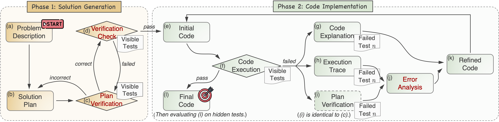

<div align="center"><h1>Planning-Driven Programming: A Large Language Model Programming Workflow</h1></div>

<p align="center">
  <a href="https://arxiv.org/abs/2411.14503">
    
  </a>
  <a href="https://github.com/you68681/lpw">
    
  </a>
</p>

This repository contains the code and dataset for our paper [**Planning-Driven Programming: A Large Language Model Programming Workflow**.](https://arxiv.org/abs/2411.14503)

We propose an LLM programming workflow (**LPW**) designed to improve both initial code generation and subsequent refinements within a structured two-phase workflow. LPW sets new state-of-the-art Pass@1 accuracy, achieving **98.2%** on HumanEval, **84.8%** on MBPP, **59.3%** on LiveCode, **62.6%** on APPS, and **34.7%** on CodeContest, using GPT-4o as the backbone.



## 📦 Installation

```bash
conda create -n lpw python=3.10
conda activate lpw
python -m pip install -r requirements.txt
```

## 📈 Usage

### Set Environment

If you use OpenAI models as backbones:

```bash
export OPENAI_API_KEY=[your OpenAI API Key]
```
For other open-source models like Phi-3 and Llama, we set up an OpenAI-compatible server based on vLLM. Here is the instruction [Setup vLLM backbones](#setup-vllm-backbones).

### Run LPW on Different Benchmarks

```bash
cd ./programming
--root_dir [output_dir] --name [running_configuration] --dataset_path [input_problem_dataset] --testfile [input_test_dataset] --strategy [code_generation_strategy] --model [LLM_models] --max_iters [code_plan_refinement_iteration] --port [port_number]
```
For example:

```bash
--root_dir ../output_data/APPS/GPT4o/ --name initial_experiment  --dataset_path ../input_data/APPS/dataset/probs.jsonl --testfile ../input_data/APPS/test/tests.jsonl --strategy lpw --model gpt-4o --max_iters 12 --port 8000
```

The output result is in `../output_data/APPS/GPT4o/`.

Available options:

| Option  | Value                                                                                                                                                                               |
| ------- |-------------------------------------------------------------------------------------------------------------------------------------------------------------------------------------|
| dataset | `HumanEval`, `MBPP`, `HumanEval-ET`,`MBPP-ET`, `MBPP-ET-3`,`LiveCode`,  `APPS`, `CodeContests`                                                                                      |
| model   | `gpt-3.5-turbo-0613`,`gpt-3.5-turbo-0125`, `gpt-4`(gpt-4-1106-preview), `gpt-4o`(gpt-4o-2024-05-13),`gpt-4o-mini`(gpt-4o-mini-2024-07-18), `Llama3`(Llama3-70b), `phi-3`(Phi-3-14b) |


```bash
Parameter Settings

--name                 Set as name for a one-time experiment  
--strategy             Code generation method (only 'lpw' is supported)  
--max_iters            Maximum iterations for plan, plan verification, and code refinements (default: 12)  
```


### Setup vLLM backbones

We use the OpenAI compatible server based on vLLM. Please refer [OpenAI-Compatible Server](https://docs.vllm.ai/en/latest/getting_started/quickstart.html#openai-compatible-server) for detailed instructions to setup the local servers. 

Please record the port number when starting the server and align it with the argument `--port` (default:`8000` )


## 🐞 Bugs or Questions?

If you have any questions, feel free to post issues in this repo.

## 📑 Citation

If you find our work helpful, please cite us:
```
@misc{lei2025planningdrivenprogramminglargelanguage,
      title={Planning-Driven Programming: A Large Language Model Programming Workflow}, 
      author={Chao Lei and Yanchuan Chang and Nir Lipovetzky and Krista A. Ehinger},
      year={2025},
      eprint={2411.14503},
      archivePrefix={arXiv},
      primaryClass={cs.SE},
      url={https://arxiv.org/abs/2411.14503}, 
}
}
```
## 🙌 Acknowledgement
Our implementation adapts code from [LDB](https://github.com/FloridSleeves/LLMDebugger). We thank their high-quality open source code!
